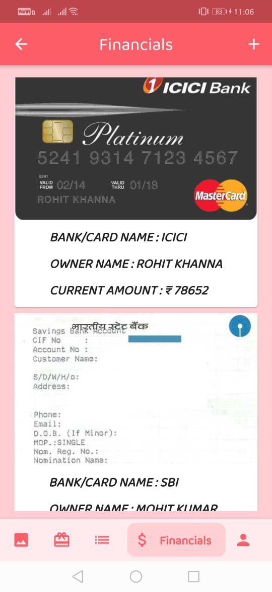

# Demently

This is a mobile flutter app that will help people suffering from memory disorders like dementia to keep track of the forgotten things and person, manage their finances, daily work schedule, maintain their day - to - day ToDo list and much more. 

## About the App
Dementia, is a class of  neurodegenerative disorders that cause progressive impairments in memory. It is a group of thinking and social symptoms that interfere with daily functioning. Symptoms include forgetfulness and limited social skills so impaired that it interferes with daily functioning. With 50 million people suffering from this syndrome across the world and a rise of 10 million more every year, It imposes a large impact on the world. 

Our App features pages like People, To- do lists, Credentials, Financials so that they can manage all their essential details that they tend to forget like their bank details, everyday chores, Passport details and many more. 

## Working

The App encompasses technologies like
#### Flutter, Dart, Firebase and Microsoft Azure. 
The App starts with a registration portal, once registered, the user will input all the relevant information which will be stored in the firebase. It also includes a voice recognition system which will automatically convert speech to text and the data will be stored. Furthermore it envelops a Face Recognition model which will scan and tell the identity of the person, helping them to remember all the lost memories.

#### Info page:

 

#### Login And Details Page:

#### People Page:

#### Credentials page:

#### Todo page:

#### Financials page:

 

#### Add on page:

 

## Built With

* [Flutter](https://flutter.dev/) - The app development framework used
* [FireBase](https://firebase.google.com/) - For User authentication and storing Data
* [Microsoft Azure](https://azure.microsoft.com/en-in/) - Used to detect faces of people

## Conclusion

We aim to bring a small yet crucial change in the situation of the disordered people by building this App which will keep them in a reach of blink apart to all the requirements.

